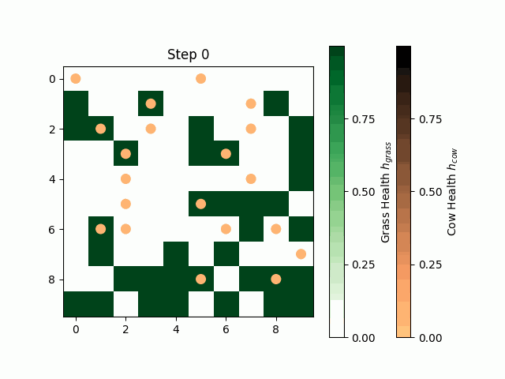

# Simple agent-based modeling of cow grazing over a square lattice

## Model Details
1. Adult cows (_agents_) are confined in a $n \times n$ square lattice (we call it _field_).
2. $n_{cows}$ are fixed throughout the grazing simulation and are initially placed randomly within the lattice.
3. Each cow possesses a health attribute named $h_{cow} \in [0,1]$.
4. Each patch within the field represents grass and is quantified by its health $h_{grass} \in [0,1]$.
5. Initially, $\rho_{grass, init}$ percent of the field will be filled with grass. $n_{cows}$ will be placed randomly and all will have $h_{cow, init}$.
6. For each time step:  
    6.1. One cow (positioned at $x_{cow}, y_{cow}$) will be selected for feeding.  
    6.2. It will select among its neighbors for grass where $h_{grass} > 0$ (positioned at $x_{grass}, y_{grass}$)  
    6.3. Once the cow chooses a nearest healthy grass patch:  
            &nbsp;&nbsp;&nbsp; 6.3.1. The cow will move to that position ($x_{grass}, y_{grass}$)  
            &nbsp;&nbsp;&nbsp; 6.3.2. The health of the cow will increase by a factor $g_{cow}$.  
            &nbsp;&nbsp;&nbsp; 6.3.3. The health of the grass patch $h_{grass}$ will decrease by a factor $e_{grass}$.  
            &nbsp;&nbsp;&nbsp; 6.3.4. In the same manner, $\rho_{grass, grow}$ percent of the field will be selected to grow by a factor $g_{grass}$.

## Sample simulation (time = 50 days):

## Questions?
If you have questions or anything that you'd like to raise, shoot me an email at jprmaulion[at]gmail[dot]com. 🐄
